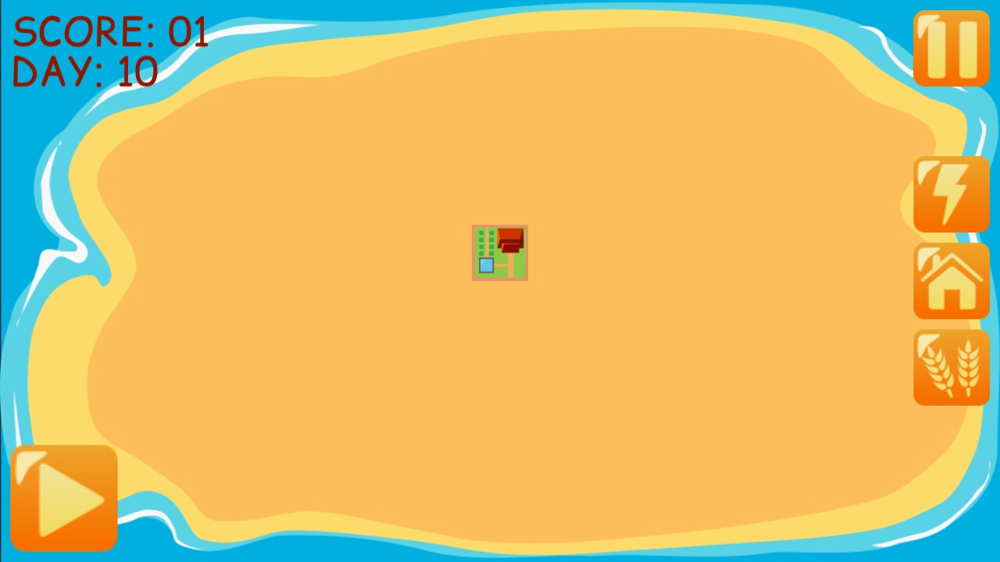
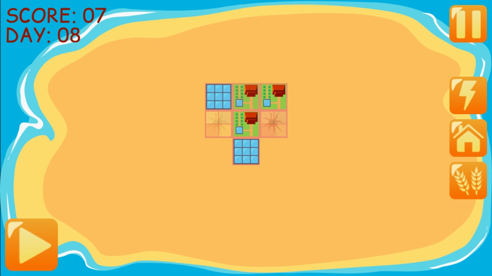
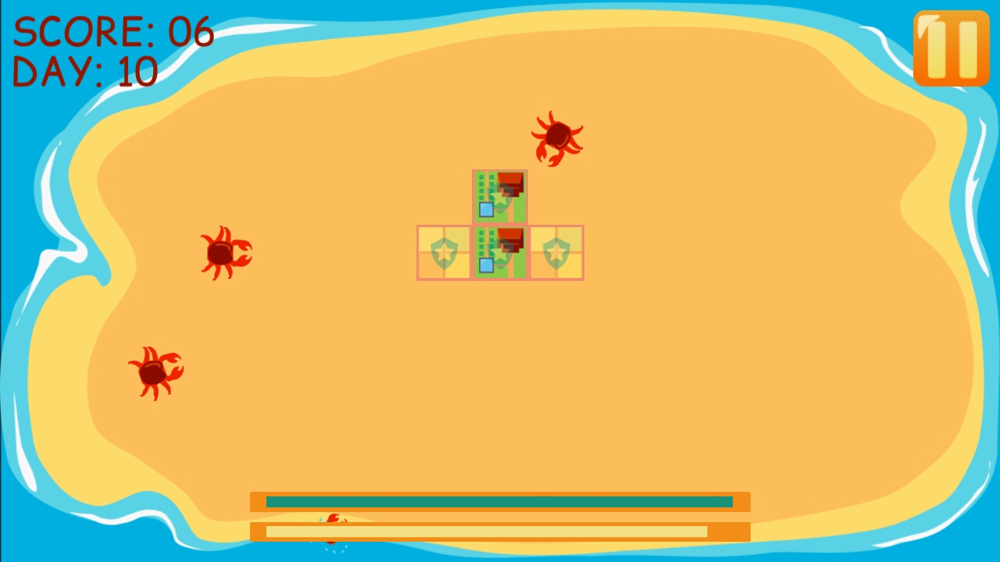

# Corona sdk game example
## What is present:
* Day\night cicle
* 1 enemy type, sequence animations for it
* 3 types of game setup (casual, normal, hard)
* Tutorial at first play casual setup, unlocks other types of game setups
* Custom sprites for controls, their animations
* Save\load preferences and highscore
* Buildings' animations
* 3 types of music (menu, day, night), transitions
## screenshots
   
